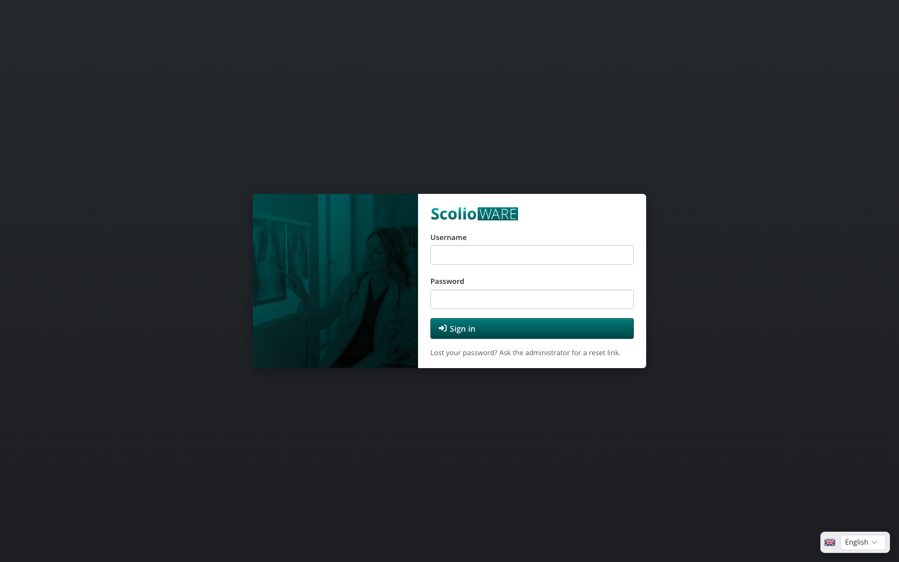
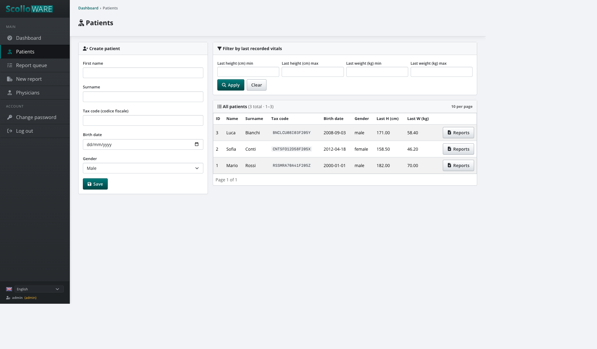
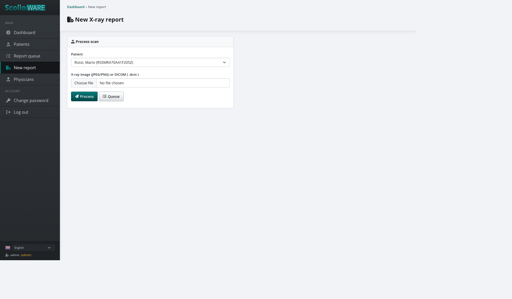
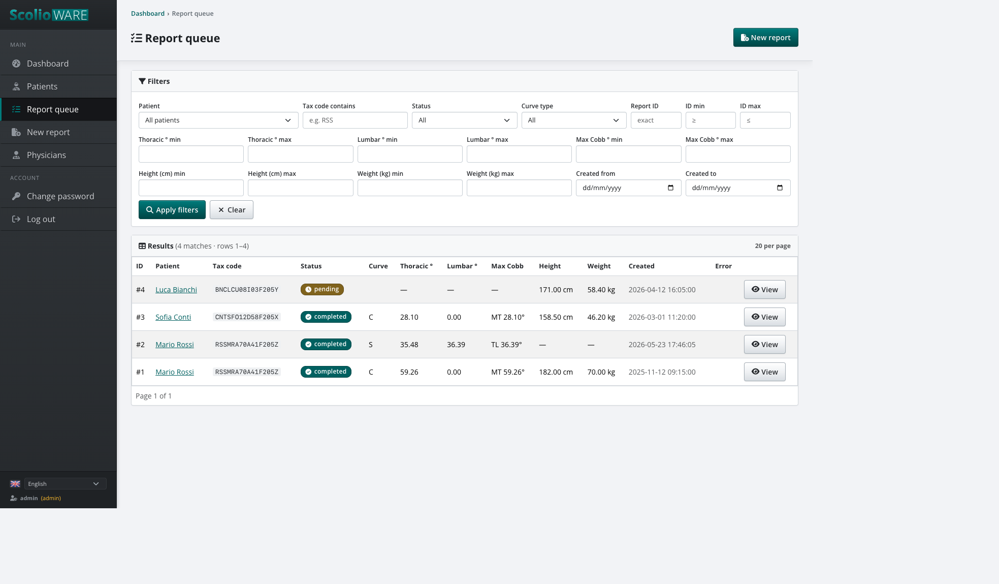
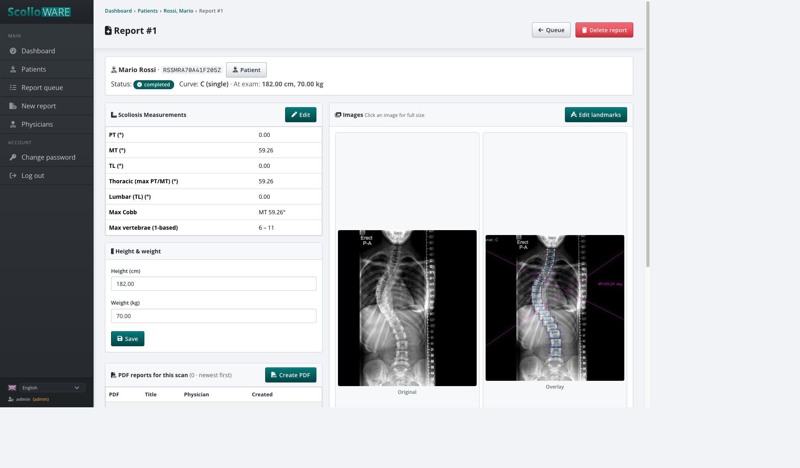
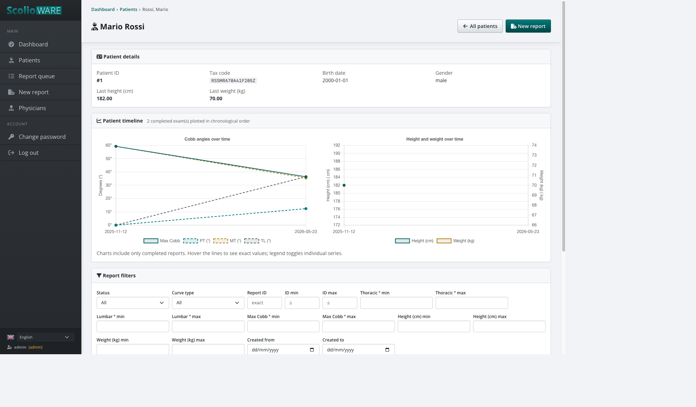
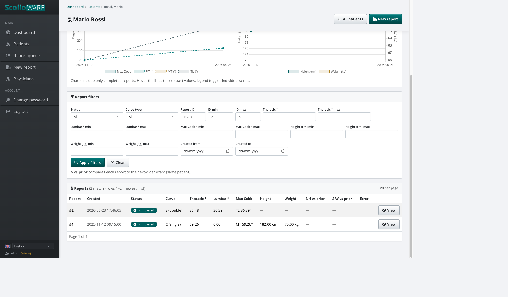
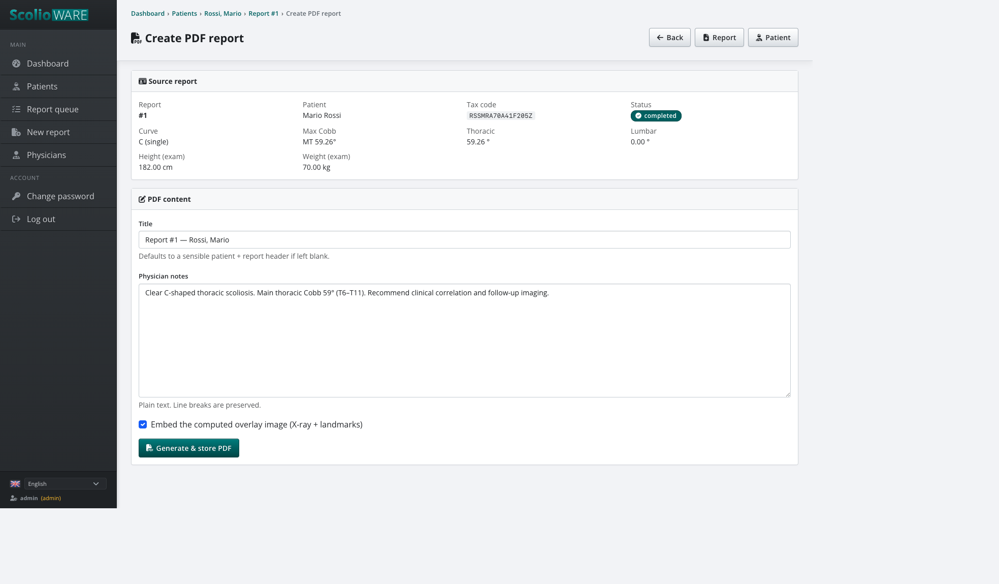
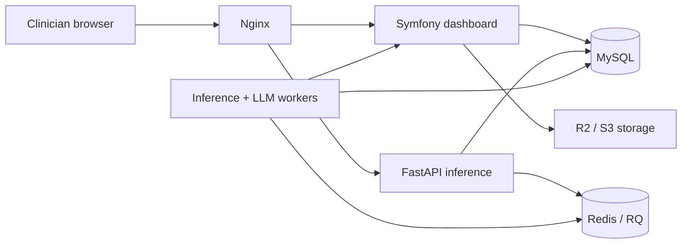

<p align="center">
  
</p>

**Scoliosis X-ray review, Cobb measurement, and PDF reporting.**

Scolioware helps a clinician keep patients, scans, measurements, and reports in one place. Upload an X-ray or DICOM file, check the Cobb angles, fix them if needed, and write a PDF. The software prepares the measurements; the physician stays in charge of the interpretation.



## Workflow

### Patients

Create a patient or open an existing one. Height and weight from the last exam show in the list.



### New report

Pick a patient, upload a JPEG, PNG, or DICOM file, and send it for processing. You can leave the page while it runs.



### Report queue

The queue shows whether a report is pending, processing, completed, or failed.



### Review

A completed report shows patient info, Cobb measurements, the original scan, the overlay, exam height/weight, and any PDFs.



The overlay draws the detected vertebrae and Cobb lines so you can check the numbers against the image.

If automatic values are wrong, you can edit the metrics by hand or drag landmark points on the X-ray. Saving landmarks recalculates the angles and updates the overlay.

### Follow-up

Charts show how Cobb angles, height, and weight change across completed exams.





### PDF

After review, generate a PDF with a title, your notes, and an optional overlay image.



An optional local AI draft (MedGemma via Ollama) can sketch a first description.

## Stack

- **Dashboard** (`apps/dashboard`): PHP 8.3, Symfony 7, Twig, Bootstrap. English and Italian.
- **Inference** (`apps/inference`): Python 3.11, FastAPI, PyTorch SpineNet, Redis Queue.
- **Data**: MySQL for records; R2/S3 for images and PDFs.
- **Run**: Docker Compose (`infra/`, `scripts/build.sh`, `scripts/run.sh`).




```
apps/dashboard/   clinician UI
apps/inference/   image processing workers
infra/            Docker, Nginx, MySQL, migrations
scripts/          build and run helpers
```

## Run locally

You need Docker, Compose v2, and Composer.

```bash
cp apps/dashboard/.env.example apps/dashboard/.env
cp apps/inference/.env.example apps/inference/.env
```

Fill `APP_SECRET` and the R2/S3 keys in `apps/dashboard/.env`. Put SpineNet weights in `apps/inference/models/spine_net_weights.pth`, or set `HF_REPO_ID` (and `HF_TOKEN` if the repo is private).

```bash
(cd apps/dashboard && composer install)
./scripts/build.sh
./scripts/run.sh
```

`./scripts/run.sh` picks CPU, NVIDIA, AMD, or Apple Silicon. Override with `SW_LLM_TARGET=cpu|nvidia|amd|mps`. On a Mac, pull the LLM with `./scripts/mps/ollama-pull-llm-model.sh`.

Open [http://localhost:8080](http://localhost:8080). phpMyAdmin is at [http://127.0.0.1:8081](http://127.0.0.1:8081).

Local default login is `admin` / `admin12345` (you must change the password on first sign-in). Set `SW_ADMIN_USER` and `SW_ADMIN_PASSWORD` to skip that. Production always requires those variables.